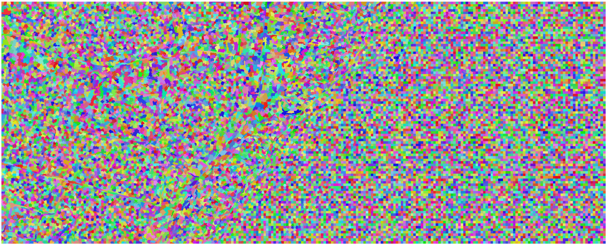
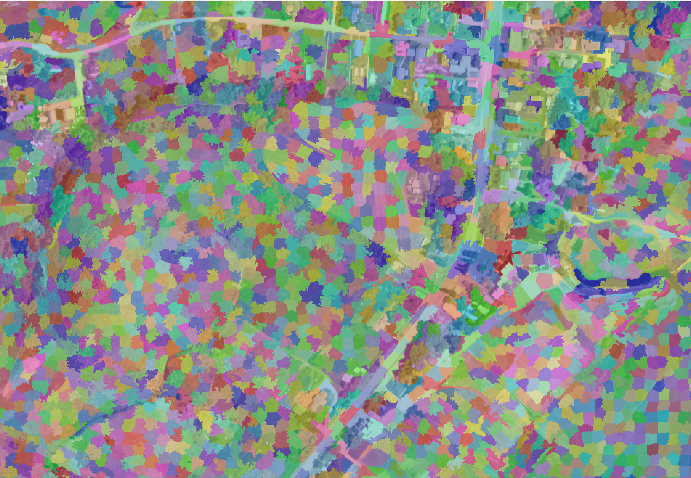
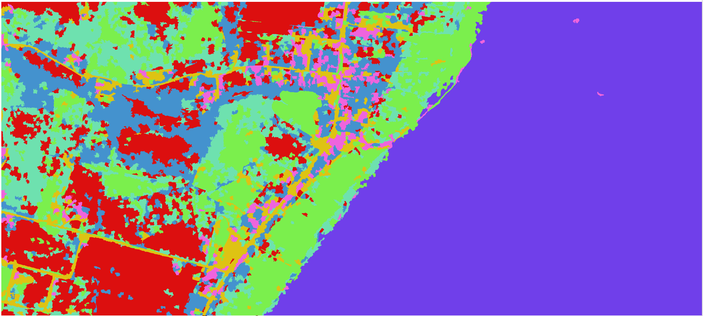

# IMAProc
Digital Geoimage Processing use an image of the National Agriculture Imagery Program (NAIP) [[link]](https://naip-usdaonline.hub.arcgis.com/) with 7 classes based on Konrad Hafen [[link]](https://opensourceoptions.com/author/admin/).

## 01 - Intro 

The Machine Learning (ML) application of ***scikit-learn*** Random Forest Classifier [[link]](https://scikit-learn.org/stable/modules/generated/sklearn.ensemble.RandomForestClassifier.html) was implemented by Robson Rogério Dutra Pereira (rrdpereira) [[link]](https://github.com/rrdpereira/), to perform the multiclass (7 classes in this case) semantic segmenataion.

## 02 - Dependences

A Miniconda [[link]](https://docs.conda.io/projects/miniconda/en/latest/miniconda-install.html/) Python enviroment was create with 3.10.11 Python version and with the following main packages:
* GDAL                    3.4.3 (offline installation on the ***gdal_exiftool_offline*** folder)
* tensorflow              2.10.1 (not used, but It's impotant to install for the future applications)
* scikit-image            0.21.0
* scikit-learn            1.3.0
* scipy                   1.11.1
* opencv-python           4.8.0.74
* numpy                   1.25.1
* geopandas               0.10.2
* pandas                  1.5.3 
* matplotlib              3.7.2

## 03 - NAIP Image Sample

The NAIP image ***m_4211161_se_12_1_20160624.tif*** was generated on 2016/06/24 (stored in the link [[link]](https://drive.google.com/file/d/1EijARm2qpfdboEdktNIFunobpYBWdLFd/view?usp=drive_link)), and have 1 m of the spatial resolution and 4 bands (R,G,B,NIR):

    

## 04 - Image Segmentation

The image segmentation can be done by using the quickshift and slic algorithm. The original NAIP was cropped to reduce the segmentation time process around to 10min approximately:

  
   
    

The final segmentation results:

  
   
    

## 05 - Ground Truth Shape file

...

  
  

## 06 - Train and Test Split Shape file

...

  
  
  

## 07 - Random Forest Results

...

  
  
  

## 08 - References

 * https://naip-usdaonline.hub.arcgis.com/

 * https://opensourceoptions.com/author/admin/

 * https://scikit-learn.org/stable/modules/generated/sklearn.ensemble.RandomForestClassifier.html

 * https://docs.conda.io/projects/miniconda/en/latest/miniconda-install.html/